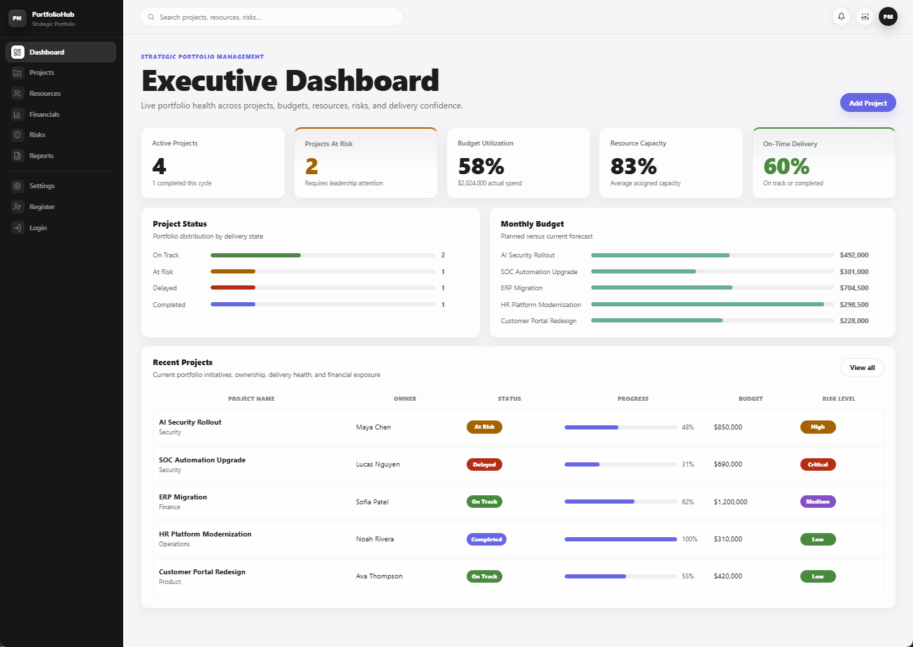
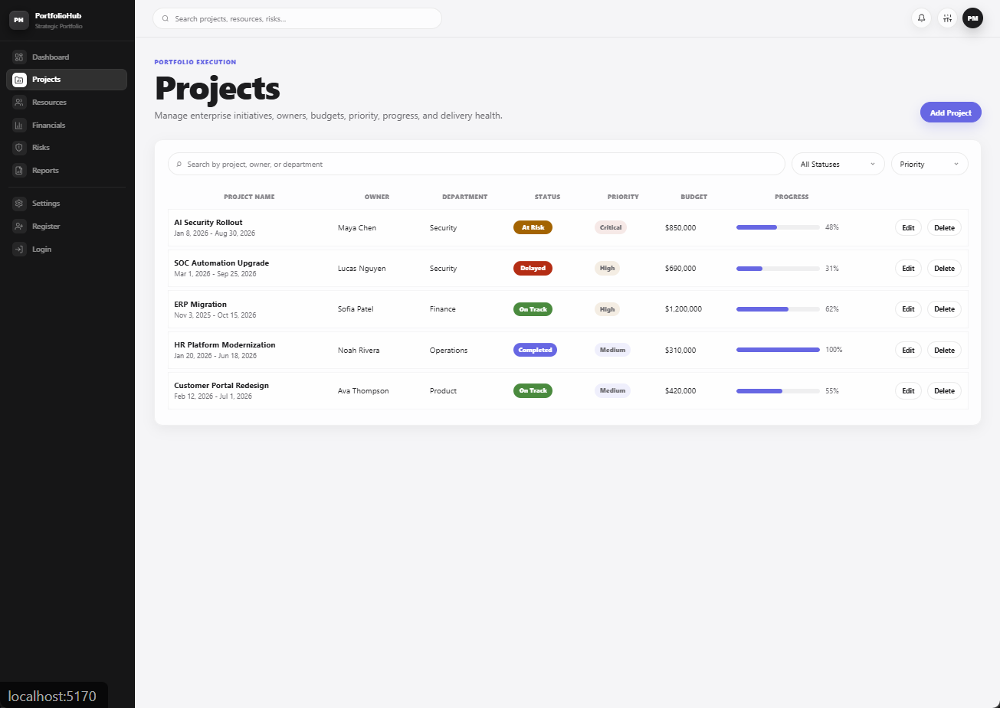
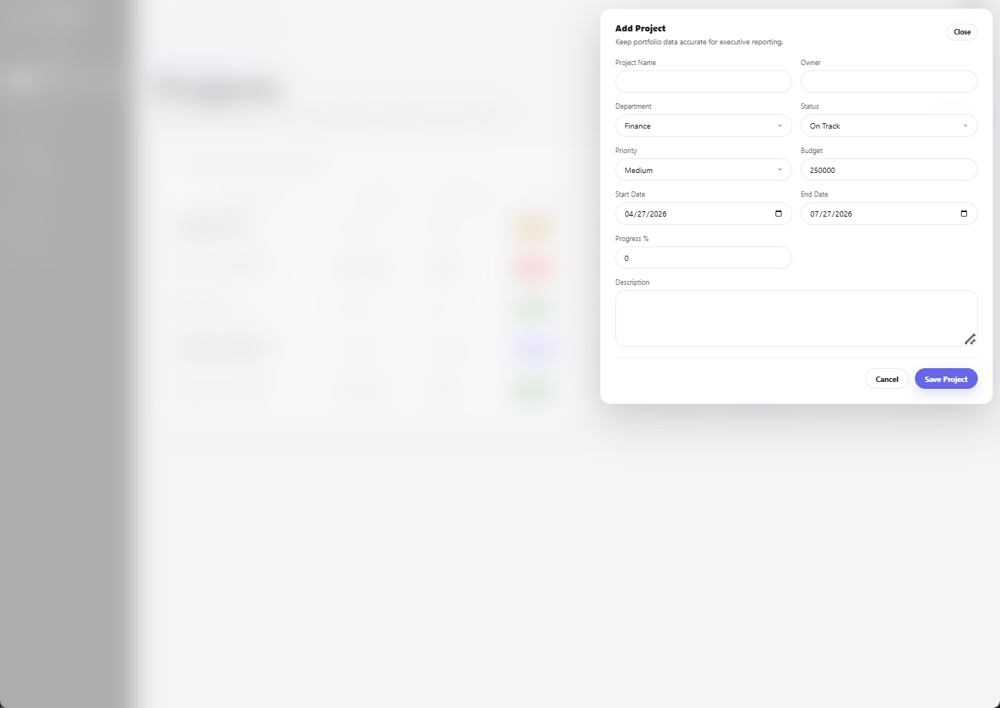
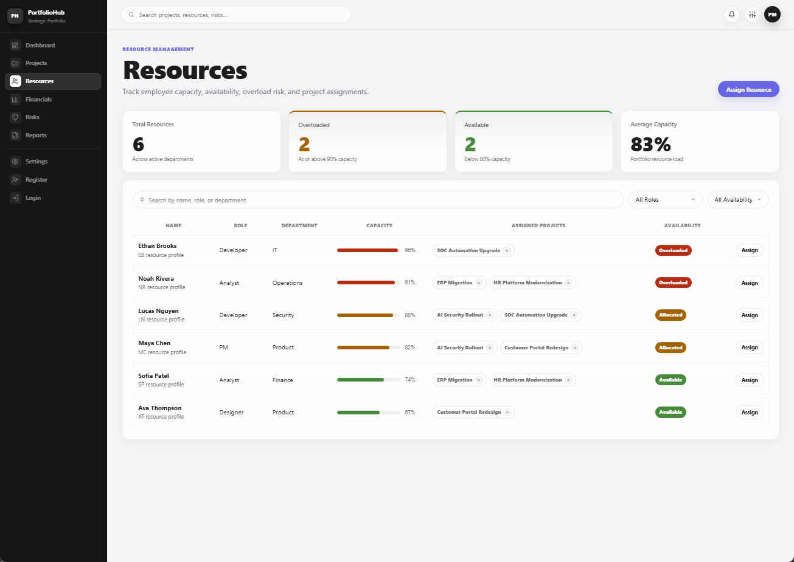
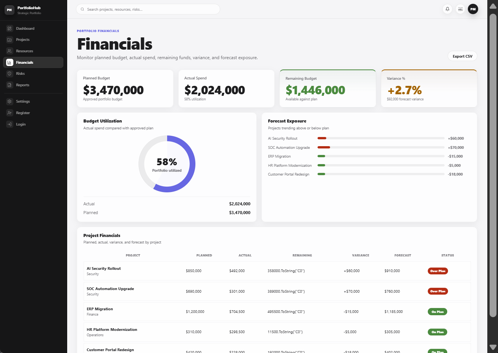
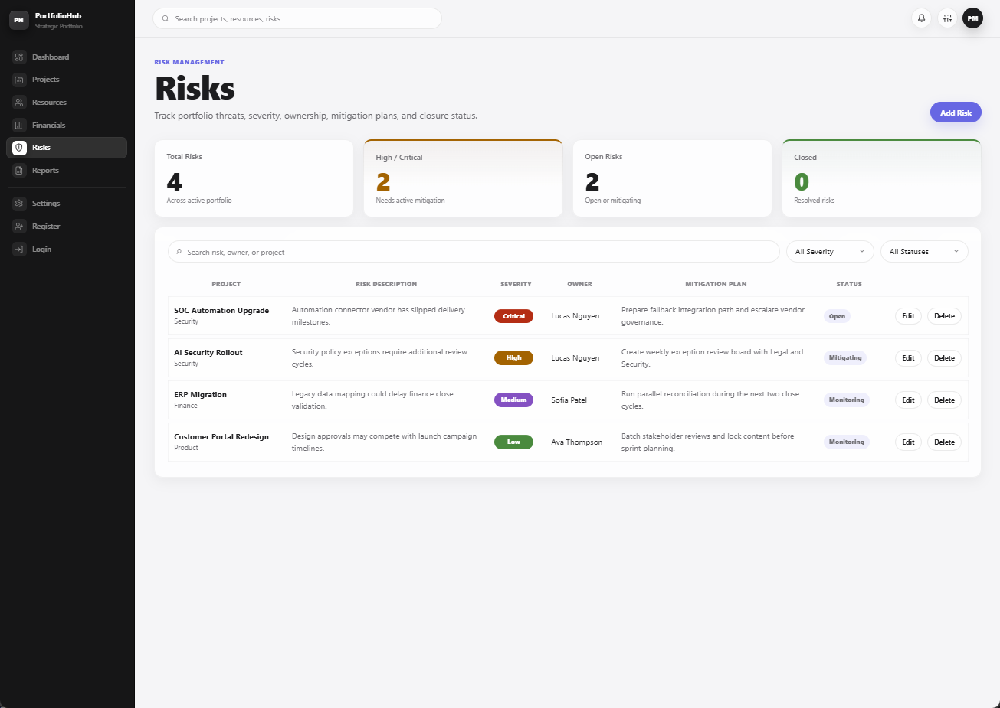
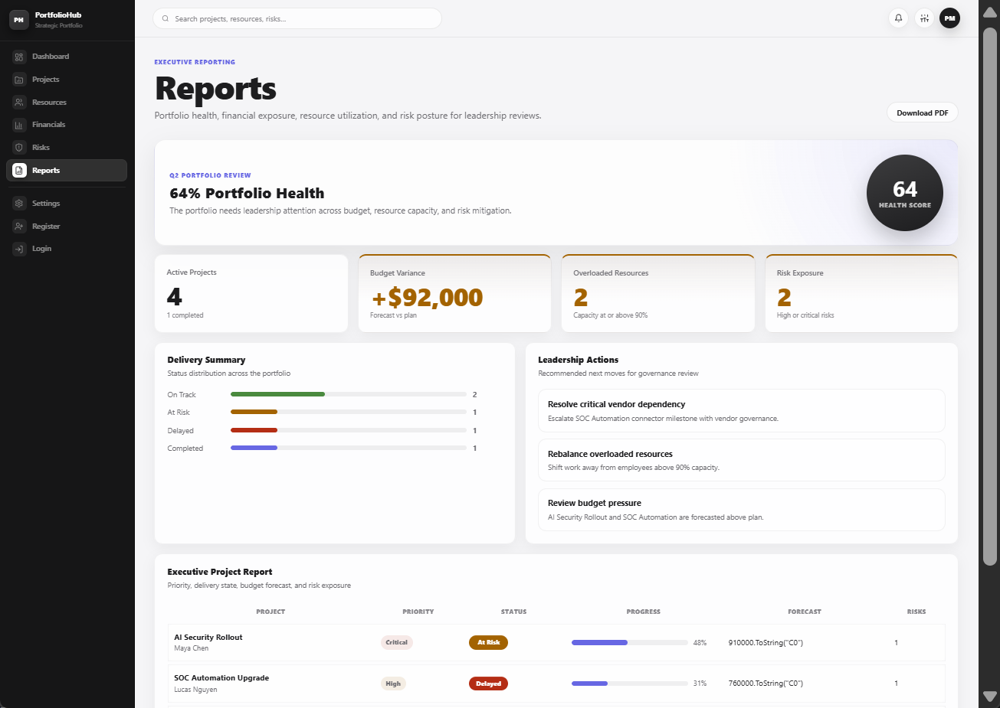

# PortfolioHub

**PortfolioHub** is an enterprise-grade Strategic Portfolio Management SaaS application built with Blazor, C#, Entity Framework Core, and SQLite. It models the real workflows used by product, finance, security, and operations leadership teams — portfolio dashboarding, project CRUD, resource capacity management, budget reporting, risk governance, and executive reporting — all behind a clean, Apple-inspired UI.

Built as a full-stack portfolio project targeting enterprise SaaS and full-stack .NET developer roles.

---

## Screenshots

### Dashboard


### Projects


### Add / Edit Project


### Resources


### Financials


### Risks


### Reports


---

## Tech Stack

| Layer | Technology |
|---|---|
| UI Framework | Blazor Web App (.NET 10, Server interactivity) |
| Language | C# |
| ORM | Entity Framework Core |
| Database | SQLite |
| Auth | ASP.NET Core Identity |
| Styling | Custom CSS (Apple-inspired design system) |
| Architecture | Repository / Service / Razor component layers |
| DI | ASP.NET Core dependency injection |
| Validation | Data annotations + custom form validation |

---

## Features

### Dashboard

Live portfolio health view driven entirely from the EF Core service layer — no static placeholder values.

- Active Projects count
- Projects At Risk count
- Budget Utilization %
- Resource Capacity %
- On-Time Delivery %
- Project status distribution breakdown
- Monthly budget vs. actual visualization
- Recent projects summary table

### Projects

Full CRUD workflow for enterprise initiatives.

- Project list with search (name, owner, department), status filter, and sort
- Add / Edit / Delete projects
- Form validation with custom date consistency rules
- Budget record created or updated on every project save
- Progress tracking (0–100%)
- Status badges: On Track · At Risk · Delayed · Completed
- Priority badges: Low · Medium · High · Critical

**Project fields:** Name, Owner, Department, Start Date, End Date, Status, Priority, Budget, Progress %, Description

### Resources

Employee capacity management and project assignment.

- Employee list with role filter and availability filter
- Capacity visualization per employee
- Overload detection with color-coded status
- Assign employee to project / remove assignment
- Assigned projects shown as inline pills

**Availability thresholds:**
- Available — under 80% capacity
- Allocated — 80–89% capacity
- Overloaded — 90%+ capacity

**Roles:** Developer · Designer · PM · Analyst

### Financials

Executive budget reporting across the entire portfolio.

- KPI cards: Planned Budget, Actual Spend, Remaining Budget, Variance %
- Budget utilization progress visualization
- Forecast exposure chart
- Per-project financial table: Planned / Actual / Remaining / Variance / Forecast / Status
- Projects forecasted above plan flagged as **Over Plan**

### Risks

Portfolio-level risk register with full CRUD.

- Risk list with search (description, owner, project), severity filter, and status filter
- Add / Edit / Delete risks
- Severity badges: Low · Medium · High · Critical
- Status tracking: Open · Monitoring · Mitigating · Closed
- Mitigation ownership per risk

**Risk fields:** Project, Description, Severity, Owner, Mitigation Plan, Status

### Reports

Executive summary view designed for leadership reviews.

- Portfolio Health Score
- Active Projects, Budget Variance, Overloaded Resources, Risk Exposure
- Delivery Summary
- Leadership Action Items
- Executive Project Report table

Demonstrates converting operational data into a management-facing report.

### Settings

Product-style administration panel.

- Workspace configuration
- Fiscal year and currency settings
- Governance thresholds
- Notification preferences
- Reporting cadence

---

## Architecture

```
Blazor Razor Pages
    └── Services
            └── Repositories
                    └── ApplicationDbContext
                                └── SQLite
```

**UI Layer** — `Components/Pages/`, `Components/Layout/`, `wwwroot/app.css`  
**Service Layer** — `Services/` — search, filter, sort, business logic  
**Repository Layer** — `Repositories/` — EF Core queries, related entity loading  
**Data Layer** — `Data/ApplicationDbContext.cs` — extends `IdentityDbContext<ApplicationUser>`

---

## Domain Model

```
Department  ──< Projects
Department  ──< Employees
Project     ──  Budget          (1-to-1)
Project     ──< Risks
Project     >──< Employees      (via ProjectEmployee join table)
```

**Entities:** `Project` · `Employee` · `Department` · `Budget` · `Risk` · `ProjectEmployee`

---

## Seed Data

The app creates realistic demo data on first startup via EF Core migrations.

**Departments:** IT · Finance · Product · Security · Operations

**Projects:** AI Security Rollout · ERP Migration · Customer Portal Redesign · SOC Automation Upgrade · HR Platform Modernization

**Employees:** Maya Chen · Ethan Brooks · Sofia Patel · Lucas Nguyen · Ava Thompson · Noah Rivera

---

## How to Run

**Prerequisites:** [.NET 10 SDK](https://dotnet.microsoft.com/download) — no external database required.

```bash
# Run
dotnet run --project PortfolioHub/PortfolioHub.csproj

# Build only
dotnet build PortfolioHub.sln
```

Open `http://localhost:5170`

The app runs `dbContext.Database.Migrate()` on startup — the SQLite database is created automatically from migrations and seed data. The `.db` file is git-ignored by design.

---

## Repository Structure

```
PortfolioHub/
├── PortfolioHub.sln
├── PortfolioHub/
│   ├── Components/
│   │   ├── Layout/         MainLayout, NavMenu
│   │   └── Pages/          Home, Projects, Resources, Financials, Risks, Reports, Settings
│   ├── Data/
│   │   ├── ApplicationDbContext.cs
│   │   └── Migrations/
│   ├── Models/
│   ├── Repositories/
│   ├── Services/
│   └── wwwroot/app.css
├── PortfolioHub.Client/
├── screenshot/
└── README.md
```

---

## Known Limitations

- Global search bar is currently visual-only (no backend query)
- Financials CSV export is a placeholder
- Reports PDF download is a placeholder
- Settings values are not yet persisted to the database
- Role-based authorization is scaffolded but not fully configured
- No automated tests yet

---

## Resume Description

**PortfolioHub** — Enterprise Strategic Portfolio Management SaaS built with Blazor (.NET 10), C#, EF Core, SQLite, and ASP.NET Core Identity. Implemented executive dashboarding, full project CRUD, resource capacity management, budget reporting, risk governance, and executive reporting behind a custom Apple-inspired design system, using a layered repository/service architecture with EF Core migrations and realistic seed data.

---

## Interview Talking Points

- Layered Blazor application: Razor components → Services → Repositories → EF Core → SQLite
- Many-to-many project/resource assignments modeled through a join entity
- EF Core migrations and seed data produce a fully working demo on first run
- Interactive CRUD with data annotation validation and custom cross-field rules
- Live KPI dashboard reading from the service layer — no hardcoded values
- Custom Apple-inspired design system built in pure CSS — no UI component library dependency
- ASP.NET Core Identity scaffolded as the auth foundation for future role-based access
